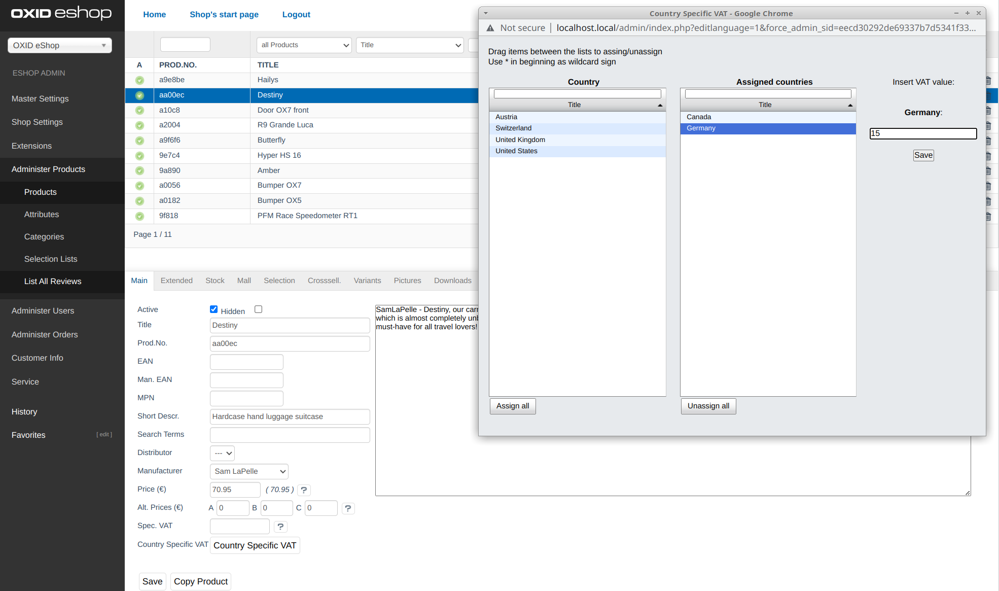
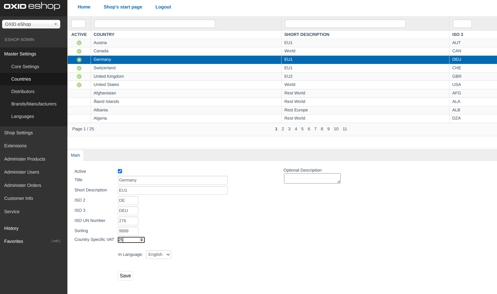

# Country VAT Administration

Allows the admin to set country specific VAT values for countries, categories and products.

The priority of country specific VAT is product, category and country value


## Branch Compatibility

* b-6.x branch / v1.x is compatible with OXID eShop compilation 6.1, 6.2 and 6.3


## Installation 

```
composer require oxid-professional-services/countryvatadministration
```

After requiring the module, you need to activate it, e.g. via OXID eShop admin.

This module requires news tables in the database which will be created on module activation: 

```SQL
CREATE TABLE `oxps_country2vat` (
  `OXID` char(32) CHARACTER SET latin1 COLLATE latin1_general_ci NOT NULL COMMENT 'id',
  `OXCOUNTRYID` char(32) CHARACTER SET latin1 COLLATE latin1_general_ci NOT NULL COMMENT 'country id',
  `OXSHOPID` int(11) NOT NULL,
  `VAT` float DEFAULT NULL COMMENT 'Value added tax. If specified, used in all calculations instead of global vat',
  PRIMARY KEY (`OXID`),
  UNIQUE KEY `OXCOUNTRYID` (`OXCOUNTRYID`,`OXSHOPID`)
) ENGINE=InnoDB DEFAULT CHARSET=utf8 COMMENT='Countries list';
```

```SQL
CREATE TABLE `oxpsarticle2countryvat` (
  `OXID` char(32) CHARACTER SET latin1 COLLATE latin1_general_ci NOT NULL COMMENT 'id',
  `OXARTICLEID` char(32) CHARACTER SET latin1 COLLATE latin1_general_ci NOT NULL COMMENT 'article id',
  `OXCOUNTRYID` char(32) CHARACTER SET latin1 COLLATE latin1_general_ci NOT NULL COMMENT 'country id',
  `OXSHOPID` int(11) NOT NULL,
  `VAT` float DEFAULT NULL COMMENT 'Value added tax. If specified, used in all calculations instead of global vat',
  PRIMARY KEY (`OXID`),
  UNIQUE KEY `OXARTCOUNTRYID` (`OXARTICLEID`,`OXCOUNTRYID`,`OXSHOPID`)
) ENGINE=InnoDB DEFAULT CHARSET=utf8 COMMENT='Countries list';

CREATE TABLE `oxpscategory2countryvat` (
  `OXID` char(32) CHARACTER SET latin1 COLLATE latin1_general_ci NOT NULL COMMENT 'id',
  `OXCATEGORYID` char(32) CHARACTER SET latin1 COLLATE latin1_general_ci NOT NULL COMMENT 'category id',
  `OXCOUNTRYID` char(32) CHARACTER SET latin1 COLLATE latin1_general_ci NOT NULL COMMENT 'country id',
  `OXSHOPID` int(11) NOT NULL,
  `VAT` float DEFAULT NULL COMMENT 'Value added tax. If specified, used in all calculations instead of global vat',
  PRIMARY KEY (`OXID`),
  UNIQUE KEY `OXCATCOUNTRYID` (`OXCATEGORYID`,`OXCOUNTRYID`,`OXSHOPID`)
) ENGINE=InnoDB DEFAULT CHARSET=utf8 COMMENT='Countries list';
```

## How to use

In shop admin select a product or category, in the 'Main' tab you will find a button
named 'Country Specific VAT'. Clicking the button opens a popup which allows you to assign
VAT per country for this product or category.



In shop admin got to `Master Settings -> Countries`, select a country and set the country specific vat in 
the input field and click save. 


