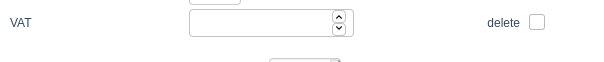

#Country VAT Administration

Allows the admin to set country specific VAT values 

Usage: Go to Admin -> Master Settings -> Countries -> Select a country and insert the VAT (percentage) you want in the
VAT input box (as demonstrated in the picture below)

Don't forget to save! 
If you do not want this value to apply anymore, then simply tick the "delete" box and click save. 

##Installation 
This module requires a new table in the database: Please run the following SQL command before activating the module:
```SQL
CREATE TABLE `oxps_country2vat` (
  `OXID` char(32) CHARACTER SET latin1 COLLATE latin1_general_ci NOT NULL COMMENT 'id',
  `OXCOUNTRYID` char(32) CHARACTER SET latin1 COLLATE latin1_general_ci NOT NULL COMMENT 'country id',
  `OXSHOPID` int(11) NOT NULL,
  `VAT` float DEFAULT NULL COMMENT 'Value added tax. If specified, used in all calculations instead of global vat',
  PRIMARY KEY (`OXID`),
  UNIQUE KEY `OXCOUNTRYID` (`OXCOUNTRYID`,`OXSHOPID`)
) ENGINE=InnoDB DEFAULT CHARSET=utf8 COMMENT='Countries list';
```